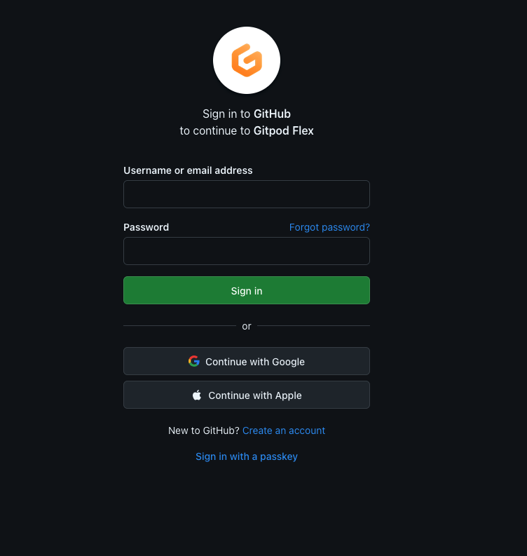
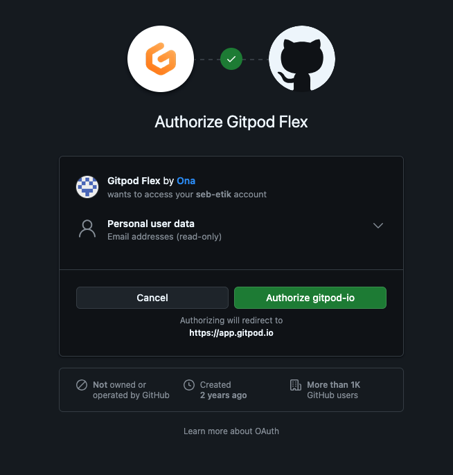
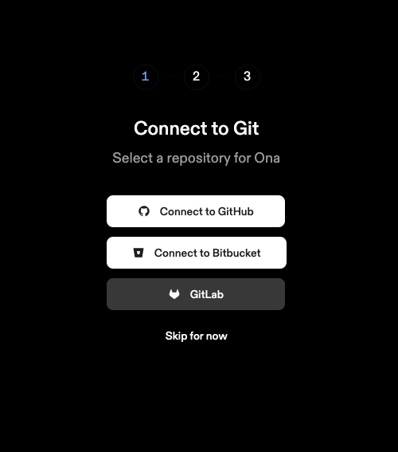
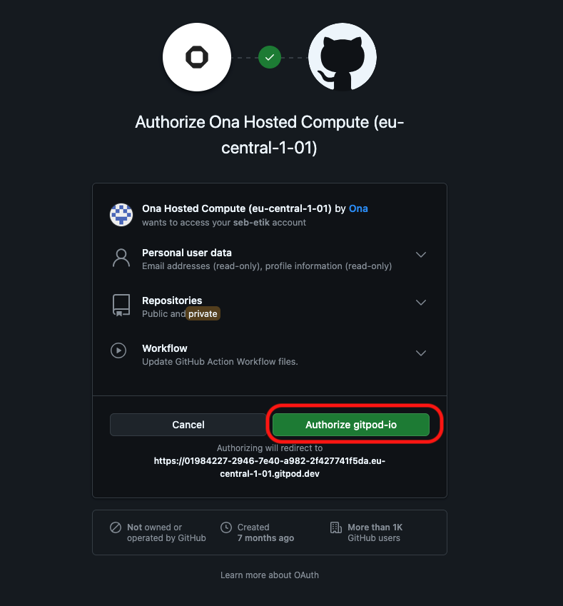
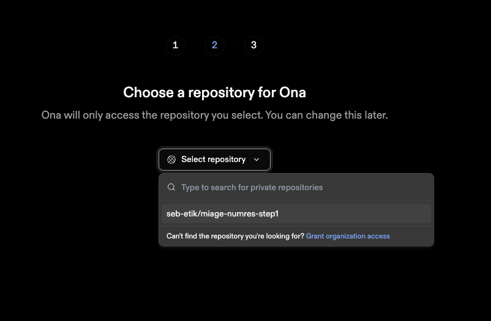
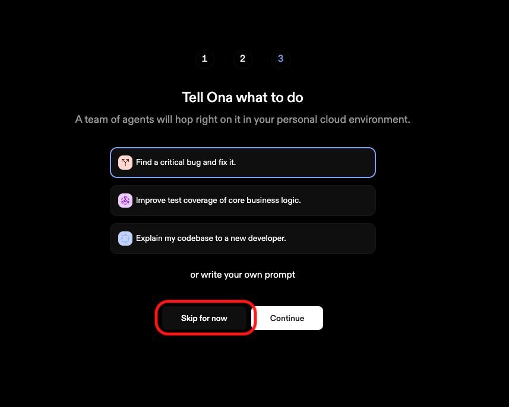

- [Sujet : Faire Burger Quizz !](#sujet---faire-burger-quizz--)
- [Notation](#notation)
- [Environnement](#environnement)
- [Déroulement](#d-roulement)
- [Creation des comptes](#creation-des-comptes)
  * [GitHub](#github)
  * [Gitpod](#gitpod)
    + [Creation compte](#creation-compte)
    + [Configuration du compte](#configuration-du-compte)
- [Fork du projet](#fork-du-projet)
- [TP1 - Stack Back-End](#tp1---stack-back-end)
- [Utiliser gitpod](#utiliser-gitpod)
  * [Test de commit](#test-de-commit)
- [API Springboot](#api-springboot)
  * [Developpement](#developpement)
  * [Packaging de l'app, execution et mesures](#packaging-de-l-app--execution-et-mesures)
- [API Quarkus](#api-quarkus)
  * [Developpement](#developpement-1)
  * [Packaging de l'app, execution et mesures](#packaging-de-l-app--execution-et-mesures-1)
- [Pull Request](#pull-request)
- [Commandes Utiles](#commandes-utiles)


# Sujet : Faire Burger Quizz !

Vous avez 4 séances de TD/TP pour  produire un site web qui permettent de répondre à des questions et  donne le score.

# Notation
 - 2pt  de rendu par séance
 - 12 pt de Questions ouvertes lors du dernier tp  (1H dernière seance)

> [!WARNING]
> Noubliez pas de faire votre pullRequest en fin de td/tp

> [!TIP]
> Il y a des commandes utiles en bas de page.

# Environnement
L'ensemble des  4 TD/TP sont à réaliser sur **_Gitpod_**.

**_Ona (anciennement Gitpod)_** est une plateforme de développement cloud qui permet de configurer des environnements de développement prêts à l’emploi pour tout projet, directement depuis un dépôt Git.
 Elle automatise la préparation des environnements (dépendances, configurations, etc.),
  réduisant ainsi le temps d’installation et les problèmes de compatibilité.
  Grâce à son intégration avec des outils comme GitHub, GitLab, et Bitbucket, Ona propose des espaces de travail reproductibles et éphémères.


# Déroulement
Dans le monde de l'*Open Source*, lorsque l'on veut contribuer à un projet, on propose des évolutions à une base de code (un **repo**) qui  seront approuvées ou non par un validateur (**reviewer**). C'est ce que l'on appel  **faire une PR**.

Vous allez reproduire le processus d'une PR pour chacun des TD/TP.

Ainsi pour chacun des TD/TPS, il faudra:
1. Dupliquer (**Forker**) le projet github
1. Modifier / compléter des fichier du repo. forké
1. Commiter vos modifs sur votre repo.
1. Proposer vos modifications sur le repo. parent (**PullRequest**)

# Creation des comptes
Vous allez créer 2 comptes: un sur GitHub et un sur Ona. Ces comptes seront utilisés lors des 4TD/TP.

## GitHub
Dans cette section nous créons un compte sur Github. Si vous en avez déjà vous pouvez passer à l'étape suivante.
1. Se rendre sur https://github.com
1. Bouton Sign up

1. Remplissez  le formulaire d'inscription

1. Connecter vous au site github avec le nouveau compte créé
1. Remplissez le formulaire

## Ona (Ex Gitpod)
### Creation compte
1. Se  rendre sur https://app.gitpod.io/login, selectionner **Continue with Github** 

1. Se connecter avec votre compte Github (si vous ne l'êtes pas déjà)

1. Authoriser Gitpod Flex by Ona  à accèder à votre compte Github

1. Vous arrivez à cet écran, conserver cet onglet ouvert dans votre navigateur 



# Fork du projet
L'objectif est de créer une copie du projet 'miage-numres-step1' sur votre compte github.

1. Se rendre sur le projet github [miage-numres-step1] (https://github.com/aepsilon-tek/miage-numres-step1)
1. Fork du projet grâce au bouton


# TP1 - Stack Back-End
L'architecture   générale de  l'application  Burger Quizz est la suivante :


Une application web consomme une API Rest  qui s'appuie sur une base de données relationnelles en  mémoire **H2**.

Ce TP1 doit permettre de  choisir la  stack d'implementation de l'api. Le choix est à faire entre **Springboot** et **Quarkus**.


# Utiliser Gitpod Flex

1. Revenez à votre onglet **Git pod Flex**
1. Autorisez **Ona Hosted Compute** à accéder à vos infos en lecture, vos repos & vos workflow github

1. La liaison entre vos comptes Ona/Github est fonctionnelle

1. Se rendre à l'url : https://app.gitpod.io/onboarding/ona/select-your-repository
1. Selectionnez le repo **XXX/**

1. Sautez l'étape d'utilisation de l'IA


Pour utiliser  **GitPod Flex** avec votre projet forké, il suffit d'ouvrir  l'url suivant dans votre navigateur :
**https://gitpod.io/#** + **URL_REPO_GITHUB**

Avec un repo _https://github.com/miage3-ae/miage-numres-step1_ alors l'url est : **https://gitpod.io/#https://github.com/miage3-ae/miage-numres-step1**

Avec l'exemple ci-dessus et étant connecté à GitPod avec votre compte, vous devez obtenir cette fenêtre:


Vous êtes désormais connecté à votre environnement de developpement.

## Test de commit
1. Répondez aux questions Q1 et Q2 dans le fichier **_Questions.md_**
2. Commiter & Pusher
3. Vérifier sur le site github que dans votre repo le fichier  **_Questions.md_** contient bien vos modifications


# API Springboot

## Developpement
1. Lancer application `springboot` en mode développement dans un Terminal
1. Tester dans un second Terminal que l'api répond : ```curl -w "\n" http://localhost:8080/api/hello ```
1. Modifier le contenu du message renvoyé
1. Tester que la modification fonctionne
1. Commiter & Pusher la modification du fichier


## Packaging de l'app, execution et mesures
1. Dans le terminal, construire l'application springboot
1. Lancer la commande `java -jar api-springboot/target/api-springboot-0.0.1-SNAPSHOT.jar`
1. Tester que l'Api répond
1. Mesurer la mémoire consommer par l'api SpringBoot `ps -e -o pid,rss,args | grep api-springboot`
Répondre aux questions Q3,Q4,Q5 et Q6 du fichier **_Questions.md_**
1. Commiter  & Pusher le fichier **_Questions.md_**


# API Quarkus
## Developpement
1. Lancer application `quarkus` en mode développement dans un Terminal
1. Tester dans un second Terminal que l'api répond : ```curl -w "\n" http://localhost:8080/hello ```
1. Modifier le contenu du message renvoyé
1. Tester que la modification fonctionne
1. Commiter & Pusher la modification du fichier


## Packaging de l'app, execution et mesures
1. Dans le terminal, construire l'application quarkus en mode JVM
1. Lancer la commande `java -jar api-quarkus/target/quarkus-app/quarkus-run.jar`
1. Mesurer la mémoire consommer par l'api quarkus `ps -e -o pid,rss,args | grep quarkus-run`
Répondre aux questions Q7,Q8 et Q9 du fichier **_Questions.md_**

1. Dans le terminal, construire l'application quarkus en mode Natif
1. Lancer la commande `./api-quarkus/target/api-quarkus-1.0.0-SNAPSHOT-runner`
1. Mesurer la mémoire consommer par l'api quarkus `ps -e -o pid,rss,args | grep runner`
Répondre aux questions Q10,Q11  du fichier **_Questions.md_**


1. Commiter  & Pusher le fichier **_Questions.md_**

# Pull Request
Une fois tous vos commits & Push réalisés sur votre repo, il est nécessaire de faire la **Pull Request** sur le repo **parent**.
Pour cela, il suffit de :
1. Se rendre sur votre compte personnel sur `GitHub`.
1. Sur la page principale, se rendre sur `Contribute` > `Open pull Request`

1. Remplir le titre de la pull request en précisant votre nom (vos noms) et `Create pull request`


# Commandes Utiles
* ```./mvnw clean compile ``` : Compilation des 2 modules (`api-quarkus` et `api-springboot` ) du projet
* ```./mvnw spring-boot:run  -pl api-springboot ``` : Lancement du projet `api-springboot` en mode developpement
* ```./mvnw clean package  -pl api-springboot ``` : Construction du projet `api-springboot`
* ```./mvnw quarkus:dev -pl api-quarkus ``` : Lancement du projet `api-quarkus` en mode developpement
* ```./mvnw clean package  -pl api-quarkus ``` : Construction du projet `api-quarkus` en mode JVM
* ```./mvnw clean package -P native  -pl api-quarkus ``` : Construction du projet `api-quarkus` en mode Natif
